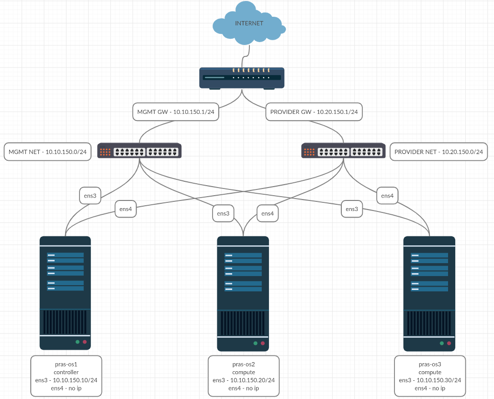

# LoadBalancer Service with Openstack Octavia

## Install Openstack Core Service + Octavia Using Kolla ansible

This tutorial using **Ussuri** release version on ubuntu 18.04 LTS

### Prerequisites

- 3 node (1 controller + 2 compute)
- Ubuntu 18.04 LTS installed on each node
- 2 interfaces on each node (mgmt network and external network)
- Internet access on both network

### Topology


### Note
- Run command below using regular user
- Run command below only on deployer node

### Installation Step

### 1. Update Repository

```
sudo apt-get update
```

### 2. Install Dependencies

```
sudo apt-get install python3-dev libffi-dev gcc libssl-dev python3-selinux python3-setuptools  python3-venv -y
```

### 3. Create Virtual Environtment

```
cd ~
python3 -m venv kolla-venv
source kolla-venv/bin/activate
```

### 4. Install Ansible and Kolla ansible

```
pip install -U pip
pip install ansible==2.9.13
pip install kolla-ansible==10.1.0
  ```

### 5. Create /etc/kolla/ Directory

```
sudo mkdir -p /etc/kolla
sudo chown $USER:$USER /etc/kolla
```

### 6. Copy globals.yml and passwords.yml to /etc/kolla directory

```
cd ~
cp -r kolla-venv/share/kolla-ansible/etc_examples/kolla/* /etc/kolla
```

### 7. Copy all-in-one and multinode inventory files to the current directory

```
cd ~
cp kolla-venv/share/kolla-ansible/ansible/inventory/* .
```

### 8. Configure Ansible
```
sudo mkdir -p /etc/ansible
```
```
sudo nano /etc/ansible/ansible.cfg
...

[defaults]
host_key_checking=False
pipelining=True
forks=100
```

### 9. Configure /etc/hosts

```
sudo nano /etc/hosts

...
10.10.150.10 pras-os1
10.10.150.20 pras-os2
10.10.150.30 pras-os3
...
```

### 10. SSH Without Password
```
ssh-keygen
```
```
for i in {1..3}; do ssh-copy-id -i ~/.ssh/id_rsa.pub $USER@pras-os$i; done
```

### 11.  Configure Multinode Inventory
Make changes to several sections as below

```
nano ~/multinode
...

[control]
pras-os1

[network]
pras-os1

[compute]
pras-os2
pras-os3

[monitoring]
pras-os1

[storage]
pras-os1

[deployment]
pras-os1 ansible_connection=local
```
__Do not make changes in other parts__

### 12.  Test Ansible Connectivity
```
ansible -i multinode all -m ping
```

### 13. Generate Kolla Password
```
kolla-genpwd
```

### 14.  Configure globals.yml

Uncoment and Make changes to several sections as below
```
nano /etc/kolla/globals.yml
...

kolla_base_distro: "ubuntu"
kolla_install_type: "source"
openstack_release: "ussuri"
kolla_internal_vip_address: "10.10.150.11"
kolla_external_vip_address: "10.10.150.12"
network_interface: "ens3"
neutron_external_interface: "ens4"
enable_neutron_provider_networks: "yes"
nova_compute_virt_type: "qemu"
enable_octavia: "yes"
```
__Do not make changes in other parts__

### 15. Generate Certificate for Octavia Amphora

Manual configuration (Recommended), follow this [step](certificates/octavia-cert-manual.md)

Using Script (For Testing) follow this [step](certificates/octavia-cert-script.md)

### 16. Run kolla ansible playbook
```
kolla-ansible -i ./multinode bootstrap-servers
kolla-ansible -i ./multinode prechecks
kolla-ansible -i ./multinode deploy
```

### 17. Post Deploy
```
kolla-ansible post-deploy
pip install python-openstackclient
```

### 18. Create octavia openrc file

Check octavia keystone password
```
grep octavia_keystone /etc/kolla/passwords.yml
...

octavia_keystone_password: VQ2vA5AsFZLzt1t1FK39sMMu2R5BXMSSXtIXOWow
```

Create /etc/kolla/octavia-openrc.sh
```
sudo nano /etc/kolla/octavia-openrc.sh
...

for key in $( set | awk '{FS="="}  /^OS_/ {print $1}' ); do unset $key ; done
export OS_PROJECT_DOMAIN_NAME=Default
export OS_USER_DOMAIN_NAME=Default
export OS_PROJECT_NAME=service
export OS_TENANT_NAME=service
export OS_USERNAME=octavia
export OS_PASSWORD=<octavia_keystone_password>
export OS_AUTH_URL=http://10.10.150.11:35357/v3
export OS_INTERFACE=internal
export OS_ENDPOINT_TYPE=internalURL
export OS_IDENTITY_API_VERSION=3
export OS_REGION_NAME=RegionOne
export OS_AUTH_PLUGIN=password
```

source to /etc/kolla/octavia-openrc.sh
```
source /etc/kolla/octavia-openrc.sh
```

### 19. Create Amphora Image

Install Dependencies
```
sudo apt install -y qemu-utils git kpartx debootstrap
```

Clone octavia repository
```
git clone https://opendev.org/openstack/octavia -b stable/ussuri
```
**Skip this step if you are create certificate using script**

Install disk-builder
```
deactivate
python3 -m venv disk-builder
source disk-builder/bin/activate
pip install diskimage-builder
```

Create Amphora Image (Default using ubuntu)
```
cd octavia/diskimage-create
./diskimage-create.sh
```

### 20. Register the image in Glance

```
deactivate
source ~/kolla-venv/bin/activate
```

```
openstack image create amphora-x64-haproxy.qcow2 --container-format bare --disk-format qcow2 --private --tag amphora --file amphora-x64-haproxy.qcow2
```

### 21. Create Amphora Flavor

```
openstack flavor create --vcpus 1 --ram 1024 --disk 3 "amphora" --private
```

### 22. Create Amphora Security Group

Amphora
```
openstack security group create lb-mgmt-sec-grp
openstack security group rule create --protocol icmp lb-mgmt-sec-grp
openstack security group rule create --protocol tcp --dst-port 22 lb-mgmt-sec-grp
openstack security group rule create --protocol tcp --dst-port 9443 lb-mgmt-sec-grp
```
Health manager
```
openstack security group create lb-health-mgr-sec-grp
openstack security group rule create --protocol udp --dst-port 5555 lb-health-mgr-sec-grp
openstack security group rule create --protocol icmp lb-health-mgr-sec-grp
```

### 23. Create Amphora Keypair

```
openstack keypair create --public-key ~/.ssh/id_rsa.pub octavia_ssh_key
```

### 24. Copy dhclient.conf to other node
Create Directory
```
sudo mkdir -m755 -p /etc/dhcp/octavia
```
Copy dhclient
```
cd ~
sudo cp octavia/etc/dhcp/dhclient.conf /etc/dhcp/octavia
```

### 25. Create octavia mgmt network and subnet
Network
```
openstack network create lb-mgmt-net
```

Subnet
```
OCTAVIA_MGMT_SUBNET=172.24.0.0/14

openstack subnet create --subnet-range $OCTAVIA_MGMT_SUBNET --gateway none --network lb-mgmt-net lb-mgmt-subnet
```

### 26. Create Octavia Health Manager Port
Create port
```
OCTAVIA_MGMT_PORT_IP=172.24.0.10

SUBNET_ID=$(openstack subnet show lb-mgmt-subnet -f value -c id)

MGMT_PORT_ID=$(openstack port create --security-group \
  lb-health-mgr-sec-grp --device-owner Octavia:health-mgr \
  --host=$(hostname) -c id -f value --network lb-mgmt-net \
  --fixed-ip subnet=$SUBNET_ID,ip-address=$OCTAVIA_MGMT_PORT_IP \
  octavia-health-manager-listen-port)
```
Bind Port to Controller
```
MGMT_PORT_MAC=$(openstack port show -c mac_address -f value $MGMT_PORT_ID)

sudo docker exec -it openvswitch_vswitchd ovs-vsctl -- --may-exist add-port br-int o-hm0 -- set Interface o-hm0 type=internal -- set Interface o-hm0 external-ids:iface-status=active -- set Interface o-hm0 external-ids:attached-mac=$MGMT_PORT_MAC -- set Interface o-hm0 external-ids:iface-id=$MGMT_PORT_ID 

sudo ip link set dev o-hm0 address $MGMT_PORT_MAC
sudo ip link set dev o-hm0 up
sudo dhclient -v o-hm0 -cf /etc/dhcp/octavia/dhclient.conf
```

### 27. Make Port Permanent on systemd
Create systemd network
```
sudo nano /etc/systemd/network/o-hm0.network
...

[Match]
Name=o-hm0

[Network]
DHCP=yes
```
Create Script
```
sudo tee -a /opt/octavia-interface.sh<<-EOF
#!/bin/bash

set -ex

MGMT_PORT_MAC=$MGMT_PORT_MAC
MGMT_PORT_ID=$MGMT_PORT_ID

if [ "$1" == "start" ]; then
  sudo docker exec -it openvswitch_vswitchd ovs-vsctl -- --may-exist add-port br-int o-hm0 -- set Interface o-hm0 type=internal -- set Interface o-hm0 external-ids:iface-status=active -- set Interface o-hm0 external-ids:attached-mac=$MGMT_PORT_MAC -- set Interface o-hm0 external-ids:iface-id=$MGMT_PORT_ID
  ip link set dev o-hm0 address $MGMT_PORT_MAC
  ip link set o-hm0 up
elif [ "$1" == "stop" ]; then
  sudo docker exec -it openvswitch_vswitchd ovs-vsctl del-port o-hm0
else
  sudo docker exec -it openvswitch_vswitchd ovs-vsctl show br-int
  ip a s dev o-hm0
fi
EOF
```
Give exe permission
```
sudo chmod +x /opt/octavia-interface.sh
```

Create Systemd service
```
sudo nano /etc/systemd/system/octavia-interface.service
...

[Unit]
Description=Octavia Interface Creator
Requires=openvswitch-switch.service
After=openvswitch-switch.service

[Service]
Type=oneshot
RemainAfterExit=true
ExecStart=/opt/octavia-interface.sh start
ExecStop=/opt/octavia-interface.sh stop

[Install]
WantedBy=multi-user.target
```
```
sudo systemctl enable octavia-interface.service
```

### 28. Add the octavia resource id into globals.yml
Check octavia resource id 
```
openstack network show lb-mgmt-net | awk '/ id / {print $4}'
openstack security group show lb-mgmt-sec-grp | awk '/ id / {print $4}'
openstack flavor show amphora | awk '/ id / {print $4}'
```
Add the octavia resource id into globals.yml

```
nano /etc/kolla/globals.yml

octavia_amp_boot_network_list: <ID of lb-mgmt-net>
octavia_amp_secgroup_list: <ID of lb-mgmt-sec-grp>
octavia_amp_flavor_id: <ID of amphora flavor>
```

### 29. Change Octavia Health Manager Config
Check Port IP Address
```
HM_IP=$(openstack port show octavia-health-manager-listen-port | awk '/ fixed_ips / {print $4}' | cut -d "'" -f 2)
echo $HM_IP
```
```
nano /etc/kolla/config/octavia.conf
...

[health_manager]
bind_ip = <HM_IP>
controller_ip_port_list = <HM_IP>:5555
```
### 30. Reconfigure Octavia

```
kolla-ansible -i ./multinode reconfigure -t octavia
```

### 31. Install octavia client
```
source ~/kolla-install/bin/activate
source /etc/kolla/admin-openrc.sh
pip install python-octaviaclient
```

## Create Resource

Create Openstack Resource 
- Network (provider & private)
- Router
- Image
- Keypair
- Flavor
- Security Group
- Instance

You can make it using horizon or using cli with the following ways

[Resource Cli Step](https://github.com/prastamaha/openstack-resource.git) 

## Octavia Flavor

- [Octavia Flavor](scenarios/flavor.md)

## Octavia Availability zone

- [Octavia Availability zone](scenarios/availabilityzone.md)

## Load Balancer scenarios
- [Basic Http](scenarios/basic-http.md)
- [TLS Termination](scenarios/tls-termination.md)
- [TLS Termination with SNI](scenarios/tls-termination-sni.md)

